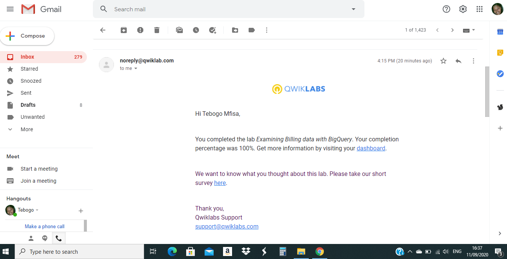
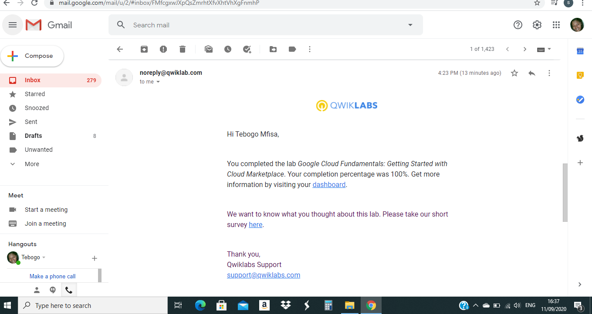
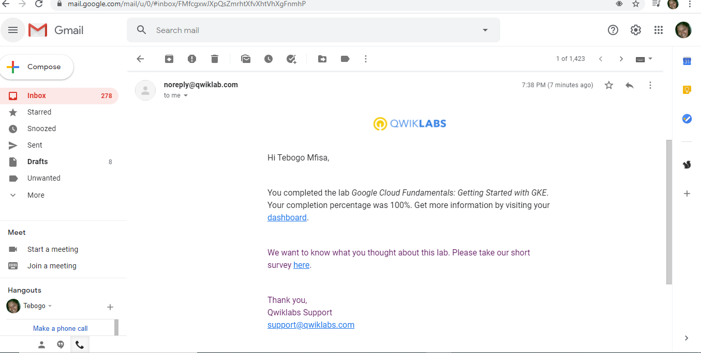
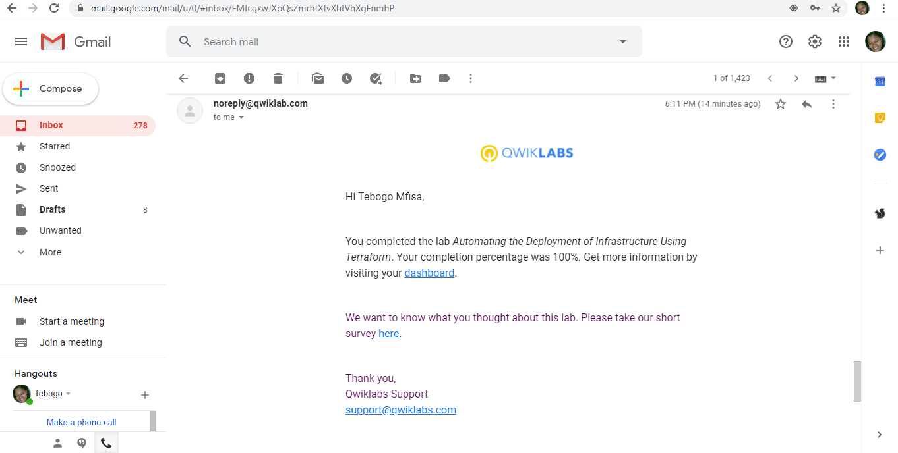
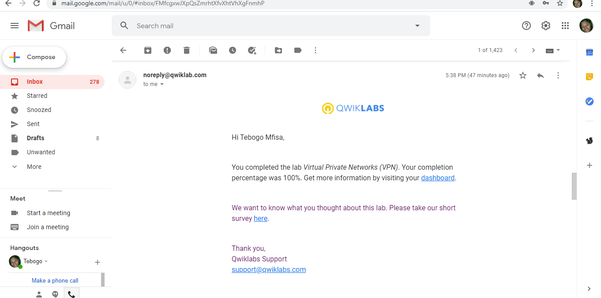

## Tebogo Mfisa
# GADS 2020 Practice Project

# QwikLabs

  
Lab 1: Examining Billing with Big Query

  

  
Lab 2: Google Cloud Fundamentals: Getting Started with Compute Engine

  

  
Lab 3: Console and Cloud Shell

  

  
Lab 4: Google Cloud Fundamentals: Getting Started with Cloud Marketplace

  

  
Lab 5: Google Cloud Fundamentals: Getting Started with GKE

  

  
Lab 6: Infrastructure Review 

  

  
Lab 7: Configuring an Internal Load Balancer

  

  
Lab 8: Resource Monitoring 

  

  
Lab 9: Automating the Deployment of Infrastructure using Terraform

  

  
Lab 10: Virtual Private Networks (VPN) 

  

  
Lab 11: Google Cloud Fundamentals: Getting Started with BigQuery 

  

# Translations

# Lab 1: Getting Started with App Engine

#### Objectives: 
#### In this lab, you learn how to perform the following tasks:
 - Initialize App Engine.
 
 - Preview an App Engine application running locally in Cloud Shell.
 
 - Deploy an App Engine application, so that others can reach it.
 
 - Disable an App Engine application, when you no longer want it to be visible.
 
#### Initialize App Engine
    
    -Initialize App Engine app with a project and choose its region:
    
        gcloud app create --project=$DEVSHELL_PROJECT_ID --region=us-central
        
    -Clone the source code repository for a sample application in the hello_world directory:
    
        git clone https://github.com/GoogleCloudPlatform/python-docs-samples
        
    -Navigate to the source directory:
    
        cd python-docs-samples/appengine/standard_python3/hello_world
        
#### Run Hello World application locally

    Download and update the packages list:
        sudo apt-get update
    set up a python virtual environment in which the application will run:
     
        sudo apt-get install virtualenv -y
        virtualenv -p python3 venv
        
    Activate the virtual environment
        
        source venv/bin/activate
    
    Navigate to the project directory and install dependencies
        
        pip install  -r requirements.txt
        
    To run the application:
        
        python main.py
        
#### Deploy and run Hello World on App Engine
    Navigate to the source directory
    
        cd ~/python-docs-samples/appengine/standard_python3/hello_world
    
    Deploy the Hello World application
    
        gcloud app deploy
     
     If prompted enter y
     
    Launch your browser to view the app
        
        gcloud app browse
        
        
#### Disable the application
        
     Enter the app ID and click disable
     
#### Congratulations! You created your first application using App Engine!
     

# Lab 2: Getting Started with GKE Engine

#### Objectives: 
#### In this lab, you learn how to perform the following tasks:
 - Provision a Kubernetes cluster using Kubernetes Engine.
 - Deploy and manage Docker containers using kubectl.
 ### Steps:

#### Confirm that needed APIs are enabled
    
    - Use the gcloud services command to confirm that both the Kubernetes Engine API and the Containers Registry API are enabled
    
        gcloud services list --enabled
  
  
#### Start a Kubernetes Engine cluster
    1. Assign your Qwiklabs zone to an environment variable called MY_ZONE:
        export MY_ZONE=us-central1-a
    
    2. Start a Kubernetes cluster managed by Kubernetes Engine. Name the cluster webfrontend and configure it to run 2 nodes:
        gcloud container clusters create webfrontend --zone $MY_ZONE --num-nodes 2
    3. After the cluster is created, check your installed version of Kubernetes using the kubectl version command:
        kubectl version

#### Run  and deploy a container
    1. Launch a single instance of the nginx container:
        kubectl create deploy nginx --image=nginx:1.17.10
    2. View the pod running the nginx container:
        kubectl get pods
    3. Expose the nginx container to the Internet:
        kubectl expose deployment nginx --port 80 --type LoadBalancer
    4. View the new service:
        kubectl get services

#### Scale up the number of pods running on your service
        kubectl scale deployment nginx --replicas 3
        
#### Confirm that Kubernetes has updated the number of pods
        kubectl get pods
        
#### Confirm that your external IP address has not change
        kubectl get services

#### Congratulations! In this lab, you configured a Kubernetes cluster in Kubernetes Engine!

You also populated the cluster with several pods containing an application, exposed the application, and scaled the application.
